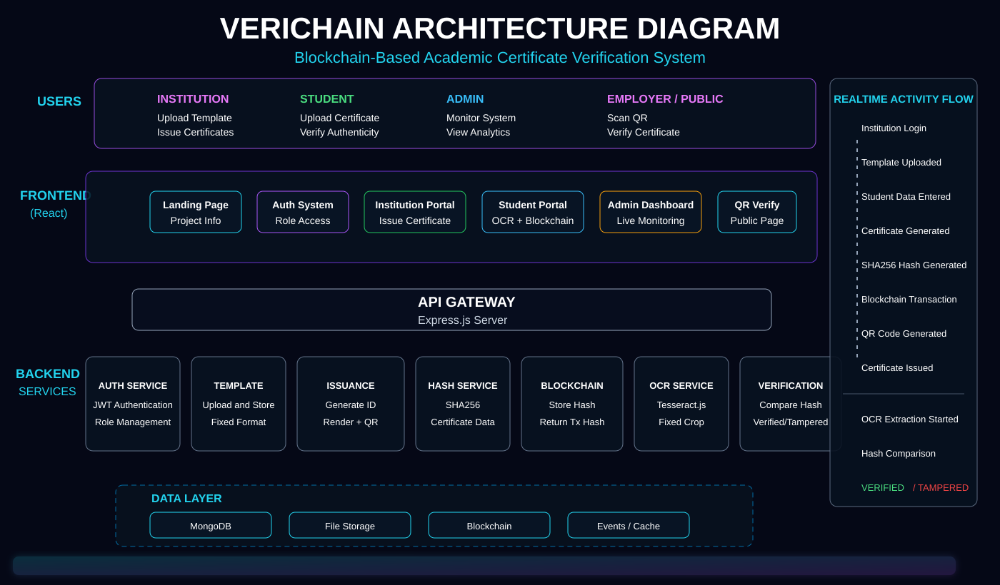

# VeriChain

Blockchain-based academic certificate verification platform with institution issuance, student OCR verification, QR validation, admin monitoring, SHA256 hashing, MongoDB storage, and blockchain proof simulation.



## Features

- Institution signup/login and certificate issuance
- Backend-generated certificate IDs
- SHA256 certificate hash generation
- Blockchain transaction hash generation
- QR code generation
- Downloadable generated certificates
- Student certificate upload and OCR extraction
- Fixed-template OCR cropping for hackathon demo flow
- Blockchain verification and tamper detection
- Admin dashboard with realtime workflow events
- Role-based protected routes for institution, student, and admin users

## Local Setup

Backend:

```bash
cd backend
npm install
npm run dev
```

Backend runs on:

```txt
http://localhost:5001
```

Frontend:

```bash
cd frontend
npm install
npm start
```

Frontend runs on:

```txt
http://localhost:3000
```

If the backend says `EADDRINUSE`, another process is already using port `5001`. Run:

```bash
cd backend
npm run free-port
npm run dev
```

## Demo Admin

```txt
Email: admin@verichain.local
Password: admin123
```

## Environment Variables

Create local files from the examples:

```bash
cp backend/.env.example backend/.env
cp frontend/.env.example frontend/.env
```

Backend variables:

```txt
PORT=5001
MONGO_URI=
JWT_SECRET=
RPC_URL=
PRIVATE_KEY=
CONTRACT_ADDRESS=
CORS_ORIGIN=http://localhost:3000
FRONTEND_URL=http://localhost:3000
DEMO_ADMIN_EMAIL=admin@verichain.local
DEMO_ADMIN_PASSWORD=admin123
```

Frontend variables:

```txt
REACT_APP_API_URL=http://localhost:5001/api
```

## Deployment

Render deployment configuration is included in:

- `render.yaml`
- `DEPLOYMENT.md`

Before deploying, rotate any exposed blockchain private key and add secrets only in the hosting provider dashboard.
